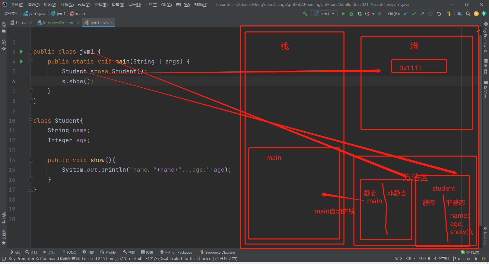

#自用面试文档

##一、HashMap的特性
**结构**
>HashMap的底层实现是数组+链表+红黑树（jdk8之后）

**数据插入**
>当往map加入元素时<br/>
>* 1、调用待插入元素的hashCode()方法，根据hashCode的值来确定存入hashMap的大数组的那一索引。
>* 2、如获取的索引空间没有元素，便直接插入到该元素位置。
>* 3、如获取的索引空间有元素，则调用插入元素的equals()方法与原元素比较。如返回true则后来元素覆盖前一元素 反之则挂在原有元素的下面形成链表结构（jdk8之后到达链表大小超过或等于8时会转化成红黑树结构）

**扩展 hashCode()与equal()的关系**
> hashCode()相等，equal()有可能相等</br>
> hashCode()不相等，equal()一定不相等</br>
> equal()相等，hashCode()一定相等</br>
> equal()不相等，hashCode()有可能相等

##二、java虚拟机中的模型

**java虚拟机有哪几块内存空间**
>**五种**
>* 1、栈内存*
>* 2、方法区*
>* 3、堆内存*
>* 4、寄存器
>* 5、本地方法区

**执行流程**


##三、ArrayList扩容规则
>* 1、空参创建arrayList时，默认长度为0
>* 2、int参数创建arrayList时，默认长度为传入的int值
>* 3、集合参数创建arrayList时，默认长度为传入的集合长度
>* 4、调用add()方法时，如果当前集合容量为零那么第一次扩容为10，遇到空间不足是便会创建以上一个容量的1.5倍的数组替换容量不足的
>> 这里的扩容并不是真正的数学乘法的1.5倍(*1.5),是先将上一个不足容量的数值右移1位在加上上一个不足容量的数值(不足的容量>>1 + 不足的容量)
>* 5、调用addAll()方法时，如遇容量不足情况时会比较下次扩容容量和待添加容量+基本容量选取数值大的为下次扩容的值

**测试代码**
 ```java
package day01.list;

import java.lang.reflect.Field;
import java.util.ArrayList;
import java.util.List;

// --add-opens java.base/java.util=ALL-UNNAMED
public class TestArrayList {
    public static void main(String[] args) {
        System.out.println(arrayListGrowRule(30));
//        testAddAllGrowEmpty();
        testAddAllGrowNotEmpty();
    }

    private static List<Integer> arrayListGrowRule(int n) {
        List<Integer> list = new ArrayList<>();
        int init = 0;
        list.add(init);
        if (n >= 1) {
            init = 10;
            list.add(init);
        }
        for (int i = 1; i < n; i++) {
            init += (init) >> 1;
            list.add(init);
        }
        return list;
    }

    private static void testAddAllGrowEmpty() {
        ArrayList<Integer> list = new ArrayList<>();
//        list.addAll(List.of(1, 2, 3));
//        list.addAll(List.of(1, 2, 3, 4, 5, 6, 7, 8, 9, 10, 11));
        System.out.println(length(list));
    }

    private static void testAddAllGrowNotEmpty() {
        ArrayList<Integer> list = new ArrayList<>();
        for (int i = 0; i < 10; i++) {
            list.add(i);
        }
//        list.addAll(List.of(1, 2, 3));
        list.addAll(List.of(1, 2, 3, 4, 5, 6));
        System.out.println(length(list));
    }

    public static int length(ArrayList<Integer> list) {
        try {
            Field field = ArrayList.class.getDeclaredField("elementData");
            field.setAccessible(true);
            return ((Object[]) field.get(list)).length;
        } catch (Exception e) {
            e.printStackTrace();
            return 0;
        }
    }


}
```
##四、Java中的异常处理机制
* **1、异常的体系结构**
> java中的异常，通俗来说就是程序的错误。</br>
> 有一个顶级的类Throwable。下有两个子类Error和Exception。Error是一些严重错误像栈内存溢出...Exception是我们比较常见的。
> Exception的子类也有两种类型RuntimeException和!RuntimeException
> 这个!RuntimeException 编译时错误（程序员必须给出解决方案，不给出不予编译通过）
* **2、异常解决方案**
>解决方法有两种1、抛给上一级；2、tryCatch处理

##五、创建线程有几种方式
创建线程的4种方式
> * 1、继承Thread类重写run方法
> * 2、实现Runnable接口重写Run方法
> * 3、实现Callable接口重写方法
> * 1、线程池
    **概述 :**

​	提到池，大家应该能想到的就是水池。水池就是一个容器，在该容器中存储了很多的水。那么什么是线程池呢？线程池也是可以看做成一个池子，在该池子中存储很多个线程。

线程池存在的意义：

​	系统创建一个线程的成本是比较高的，因为它涉及到与操作系统交互，当程序中需要创建大量生存期很短暂的线程时，频繁的创建和销毁线程对系统的资源消耗有可能大于业务处理是对系

​	统资源的消耗，这样就有点"舍本逐末"了。针对这一种情况，为了提高性能，我们就可以采用线程池。线程池在启动的时，会创建大量空闲线程，当我们向线程池提交任务的时，线程池就

​	会启动一个线程来执行该任务。等待任务执行完毕以后，线程并不会死亡，而是再次返回到线程池中称为空闲状态。等待下一次任务的执行。

**线程池的设计思路 :**

1. 准备一个任务容器
2. 一次性启动多个(2个)消费者线程
3. 刚开始任务容器是空的，所以线程都在wait
4. 直到一个外部线程向这个任务容器中扔了一个"任务"，就会有一个消费者线程被唤醒
5. 这个消费者线程取出"任务"，并且执行这个任务，执行完毕后，继续等待下一次任务的到来

**线程池-Executors默认线程池**

概述 : JDK对线程池也进行了相关的实现，在真实企业开发中我们也很少去自定义线程池，而是使用JDK中自带的线程池。

我们可以使用Executors中所提供的**静态**方法来创建线程池

​	static ExecutorService newCachedThreadPool()   创建一个默认的线程池
​	static newFixedThreadPool(int nThreads)	    创建一个指定最多线程数量的线程池

**代码实现 :**

```java
package com.itheima.mythreadpool;


//static ExecutorService newCachedThreadPool()   创建一个默认的线程池
//static newFixedThreadPool(int nThreads)	    创建一个指定最多线程数量的线程池

import java.util.concurrent.ExecutorService;
import java.util.concurrent.Executors;

public class MyThreadPoolDemo {
    public static void main(String[] args) throws InterruptedException {

        //1,创建一个默认的线程池对象.池子中默认是空的.默认最多可以容纳int类型的最大值.
        ExecutorService executorService = Executors.newCachedThreadPool();
        //Executors --- 可以帮助我们创建线程池对象
        //ExecutorService --- 可以帮助我们控制线程池

        executorService.submit(()->{
            System.out.println(Thread.currentThread().getName() + "在执行了");
        });

        //Thread.sleep(2000);

        executorService.submit(()->{
            System.out.println(Thread.currentThread().getName() + "在执行了");
        });

        executorService.shutdown();
    }
}

```
**使用Executors中所提供的静态方法来创建线程池**

​	static ExecutorService newFixedThreadPool(int nThreads) : 创建一个指定最多线程数量的线程池

**代码实现 :**

```java
package com.itheima.mythreadpool;

//static ExecutorService newFixedThreadPool(int nThreads)
//创建一个指定最多线程数量的线程池

import java.util.concurrent.ExecutorService;
import java.util.concurrent.Executors;
import java.util.concurrent.ThreadPoolExecutor;

public class MyThreadPoolDemo2 {
    public static void main(String[] args) {
        //参数不是初始值而是最大值
        ExecutorService executorService = Executors.newFixedThreadPool(10);

        ThreadPoolExecutor pool = (ThreadPoolExecutor) executorService;
        System.out.println(pool.getPoolSize());//0

        executorService.submit(()->{
            System.out.println(Thread.currentThread().getName() + "在执行了");
        });

        executorService.submit(()->{
            System.out.println(Thread.currentThread().getName() + "在执行了");
        });

        System.out.println(pool.getPoolSize());//2
//        executorService.shutdown();
    }
}

```

**线程池-ThreadPoolExecutor**

**创建线程池对象 :**

ThreadPoolExecutor threadPoolExecutor = new ThreadPoolExecutor(核心线程数量,最大线程数量,空闲线程最大存活时间,任务队列,创建线程工厂,任务的拒绝策略);

**代码实现 :**

```java
package com.itheima.mythreadpool;

import java.util.concurrent.ArrayBlockingQueue;
import java.util.concurrent.Executors;
import java.util.concurrent.ThreadPoolExecutor;
import java.util.concurrent.TimeUnit;

public class MyThreadPoolDemo3 {
//    参数一：核心线程数量
//    参数二：最大线程数
//    参数三：空闲线程最大存活时间
//    参数四：时间单位
//    参数五：任务队列
//    参数六：创建线程工厂
//    参数七：任务的拒绝策略
    public static void main(String[] args) {
        ThreadPoolExecutor pool = new ThreadPoolExecutor(2,5,2,TimeUnit.SECONDS,new ArrayBlockingQueue<>(10), Executors.defaultThreadFactory(),new ThreadPoolExecutor.AbortPolicy());
        pool.submit(new MyRunnable());
        pool.submit(new MyRunnable());

        pool.shutdown();
    }
}


