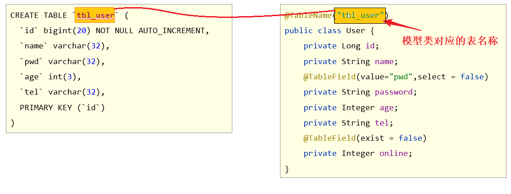
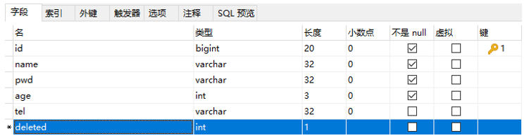

#MybatisPlus学习记录

##1.条件查询的三种方式
<hr></hr>

* 1 按条件查询
```java
QueryWrapper<User> qw=new QueryWrapper<>();
        qw.lt("age", 18);
        List<User> userList = userDao.selectList(qw);
        System.out.println(userList);
```
* 2 lambda方式
```java
QueryWrapper<User> qw=new QueryWrapper<>();
        qw.lambda.lt(User::getAge, 18);
        List<User> userList = userDao.selectList(qw);
        System.out.println(userList);
```
* 3 lambda（new Lambda方式）
```java
LambdaQueryWrapper<User> lw=new LambdaQueryWrapper<>();
    lw.eq(User::getId,"1");
    List<User> userList = userDao.selectList(qw);
    System.out.println(userList);
```
##2.参数null值的处理
> 当前端传输的查询条件为空时如何处理？<br/>
> mp的代理对象mapper中的查询方法的参数中一般都带有boolean的参数，这个参数表示是否要添加此参数

```java
@Autowired
private UserMapper usermapper;

//此假如前端传入数据已经封装成一个String类型的数据name
public void testParameter{
        QueryWrapper<User> querywrapper=new QueryWrapper();
        querywrapper.like(null != name ,null);//这里的like eq lt le 等比较方法都有boolean参数来判断是否需要添加参数
        List<User> list=usermapper.selectList(querywrapper);
}
```

## 3. 字段映射与表名映射

### 问题导入

思考表的字段和实体类的属性不对应，查询会怎么样？

### 3.1 问题一：表字段与编码属性设计不同步

- 在模型类属性上方，使用**@TableField**属性注解，通过==**value**==属性，设置当前属性对应的数据库表中的字段关系。


### 3.2 问题二：编码中添加了数据库中未定义的属性

- 在模型类属性上方，使用**@TableField**注解，通过**==exist==**属性，设置属性在数据库表字段中是否存在，默认为true。此属性无法与value合并使用。


### 3.3 问题三：采用默认查询开放了更多的字段查看权限

- 在模型类属性上方，使用**@TableField**注解，通过**==select==**属性：设置该属性是否参与查询。此属性与select()映射配置不冲突。


#### 4.4 问题四：表名与编码开发设计不同步

- 在<u>**模型类**</u>上方，使用**@TableName**注解，通过**==value==**属性，设置当前类对应的数据库表名称。



```java
@Data
@TableName("tbl_user")
public class User {
    /*
        id为Long类型，因为数据库中id为bigint类型，
        并且mybatis有自己的一套id生成方案，生成出来的id必须是Long类型
     */
    private Long id;
    private String name;
    @TableField(value = "pwd",select = false)
    private String password;
    private Integer age;
    private String tel;
    @TableField(exist = false) //表示online字段不参与CRUD操作
    private Boolean online;
}
```


## 三、DML编程控制

### 1. id生成策略控制（Insert）

#### 问题导入

主键生成的策略有哪几种方式？

不同的表应用不同的id生成策略

- 日志：自增（1,2,3,4，……）
- 购物订单：特殊规则（FQ23948AK3843）
- 外卖单：关联地区日期等信息（10 04 20200314 34 91）
- 关系表：可省略id
- ……

#### 1.1 id生成策略控制（@TableId注解）

- 名称：@TableId

- 类型：**属性注解**

- 位置：模型类中用于表示主键的属性定义上方

- 作用：设置当前类中主键属性的生成策略

- 相关属性

  ​	**type**：设置主键属性的生成策略，值参照IdType枚举值

  

#### 1.2 全局策略配置

```yml
mybatis-plus:
  global-config:
    db-config:
      id-type: assign_id
      table-prefix: tbl_
```

##### id生成策略全局配置


##### 表名前缀全局配置


### 2. 多记录操作（批量Delete/Select）

#### 问题导入

MyBatisPlus是否支持批量操作？


#### 2.1 按照主键删除多条记录

```java
//删除指定多条数据
List<Long> list = new ArrayList<>();
list.add(1402551342481838081L);
list.add(1402553134049501186L);
list.add(1402553619611430913L);

userDao.deleteBatchIds(list);
```

#### 2.2 根据主键查询多条记录

```java
//查询指定多条数据
List<Long> list = new ArrayList<>();
list.add(1L);
list.add(3L);
list.add(4L);
userDao.selectBatchIds(list);
```

### 3. 逻辑删除（Delete/Update）

#### 问题导入

在实际环境中，如果想删除一条数据，是否会真的从数据库中删除该条数据？

- 删除操作业务问题：业务数据从数据库中丢弃

- 逻辑删除：为数据设置是否可用状态字段，删除时设置状态字段为不可用状态，数据保留在数据库中


#### 3.1 逻辑删除案例

##### ①：数据库表中添加逻辑删除标记字段



##### ②：实体类中添加对应字段，并设定当前字段为逻辑删除标记字段

```java
package com.itheima.domain;

import com.baomidou.mybatisplus.annotation.*;

import lombok.Data;

@Data
public class User {

    private Long id;
    
    //逻辑删除字段，标记当前记录是否被删除
    @TableLogic
    private Integer deleted;
    
}
```

##### ③：配置逻辑删除字面值

```yml
mybatis-plus:
  global-config:
    db-config:
      table-prefix: tbl_
      # 逻辑删除字段名
      logic-delete-field: deleted
      # 逻辑删除字面值：未删除为0
      logic-not-delete-value: 0
      # 逻辑删除字面值：删除为1
      logic-delete-value: 1
```

**逻辑删除本质：逻辑删除的本质其实是修改操作。如果加了逻辑删除字段，查询数据时也会自动带上逻辑删除字段。**


### 4. 乐观锁（Update）

#### 问题导入

乐观锁主张的思想是什么？

- 业务并发现象带来的问题：秒杀


#### 4.1 乐观锁案例

##### ①：数据库表中添加锁标记字段


##### ②：实体类中添加对应字段，并设定当前字段为逻辑删除标记字段

```java
package com.itheima.domain;

import com.baomidou.mybatisplus.annotation.TableField;
import com.baomidou.mybatisplus.annotation.TableLogic;
import com.baomidou.mybatisplus.annotation.Version;
import lombok.Data;

@Data
public class User {

	private Long id;
	
    @Version
    private Integer version;
}

```

##### ③：配置乐观锁拦截器实现锁机制对应的动态SQL语句拼装

```java
package com.itheima.config;

import com.baomidou.mybatisplus.extension.plugins.MybatisPlusInterceptor;
import com.baomidou.mybatisplus.extension.plugins.inner.OptimisticLockerInnerInterceptor;
import com.baomidou.mybatisplus.extension.plugins.inner.PaginationInnerInterceptor;
import org.springframework.context.annotation.Bean;
import org.springframework.context.annotation.Configuration;

@Configuration
public class MpConfig {
    @Bean
    public MybatisPlusInterceptor mpInterceptor() {
        //1.定义Mp拦截器
        MybatisPlusInterceptor mpInterceptor = new MybatisPlusInterceptor();

        //2.添加乐观锁拦截器
        mpInterceptor.addInnerInterceptor(new OptimisticLockerInnerInterceptor());
        
        return mpInterceptor;
    }
}

```

##### ④：使用乐观锁机制在修改前必须先获取到对应数据的verion方可正常进行

```java
@Test
public void testUpdate() {
    /*User user = new User();
    user.setId(3L);
    user.setName("Jock666");
    user.setVersion(1);
    userDao.updateById(user);*/
    
    //1.先通过要修改的数据id将当前数据查询出来
    //User user = userDao.selectById(3L);
    //2.将要修改的属性逐一设置进去
    //user.setName("Jock888");
    //userDao.updateById(user);
    
    //1.先通过要修改的数据id将当前数据查询出来
    User user = userDao.selectById(3L);     //version=3
    User user2 = userDao.selectById(3L);    //version=3
    user2.setName("Jock aaa");
    userDao.updateById(user2);              //version=>4
    user.setName("Jock bbb");
    userDao.updateById(user);               //verion=3?条件还成立吗？
}
```


## 五、快速开发-代码生成器

### 问题导入

如果只给一张表的字段信息，能够推演出Domain、Dao层的代码？

### 1. MyBatisPlus提供模板

- Mapper接口模板


- 实体对象类模板


### 2. 工程搭建和基本代码编写

- 第一步：创建SpringBoot工程，添加代码生成器相关依赖，其他依赖自行添加

```xml
<!--代码生成器-->
<dependency>
    <groupId>com.baomidou</groupId>
    <artifactId>mybatis-plus-generator</artifactId>
    <version>3.4.1</version>
</dependency>

<!--velocity模板引擎-->
<dependency>
    <groupId>org.apache.velocity</groupId>
    <artifactId>velocity-engine-core</artifactId>
    <version>2.3</version>
</dependency>
```

- 第二步：编写代码生成器类

```java
package com.itheima;

import com.baomidou.mybatisplus.generator.AutoGenerator;
import com.baomidou.mybatisplus.generator.config.DataSourceConfig;

public class Generator {
    public static void main(String[] args) {
        //1. 创建代码生成器对象，执行生成代码操作
        AutoGenerator autoGenerator = new AutoGenerator();

        //2. 数据源相关配置：读取数据库中的信息，根据数据库表结构生成代码
        DataSourceConfig dataSource = new DataSourceConfig();
        dataSource.setDriverName("com.mysql.cj.jdbc.Driver");
        dataSource.setUrl("jdbc:mysql://localhost:3306/mybatisplus_db?serverTimezone=UTC");
        dataSource.setUsername("root");
        dataSource.setPassword("root");
        autoGenerator.setDataSource(dataSource);

         //3. 执行生成操作
        autoGenerator.execute();
    }
}

```

### 3. 开发者自定义配置

- 设置全局配置

```java
//设置全局配置
GlobalConfig globalConfig = new GlobalConfig();
globalConfig.setOutputDir(System.getProperty("user.dir")+"/mybatisplus_04_generator/src/main/java");    //设置代码生成位置
globalConfig.setOpen(false);    //设置生成完毕后是否打开生成代码所在的目录
globalConfig.setAuthor("黑马程序员");    //设置作者
globalConfig.setFileOverride(true);     //设置是否覆盖原始生成的文件
globalConfig.setMapperName("%sDao");    //设置数据层接口名，%s为占位符，指代模块名称
globalConfig.setIdType(IdType.ASSIGN_ID);   //设置Id生成策略
autoGenerator.setGlobalConfig(globalConfig);
```

- 设置包名相关配置

```java
//设置包名相关配置
PackageConfig packageInfo = new PackageConfig();
packageInfo.setParent("com.aaa");   //设置生成的包名，与代码所在位置不冲突，二者叠加组成完整路径
packageInfo.setEntity("domain");    //设置实体类包名
packageInfo.setMapper("dao");   //设置数据层包名
autoGenerator.setPackageInfo(packageInfo);
```

- 策略设置

```java
//策略设置
StrategyConfig strategyConfig = new StrategyConfig();
strategyConfig.setInclude("tbl_user");  //设置当前参与生成的表名，参数为可变参数
strategyConfig.setTablePrefix("tbl_");  //设置数据库表的前缀名称，模块名 = 数据库表名 - 前缀名  例如： User = tbl_user - tbl_
strategyConfig.setRestControllerStyle(true);    //设置是否启用Rest风格
strategyConfig.setVersionFieldName("version");  //设置乐观锁字段名
strategyConfig.setLogicDeleteFieldName("deleted");  //设置逻辑删除字段名
strategyConfig.setEntityLombokModel(true);  //设置是否启用lombok
autoGenerator.setStrategy(strategyConfig);
```

> 说明：在资料中也提供了CodeGenerator代码生成器类，根据实际情况修改后可以直接使用。


