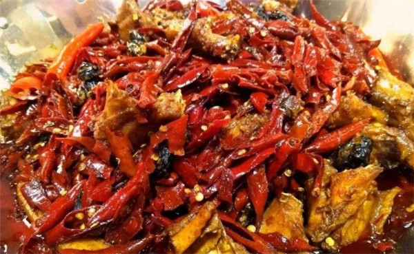

##MarkDown快速入门
```java
//java代码块
//```+(语言类型)
class HelloWorld{
    public static void main(String[] args) {
        System.out.println("我是帅哥！");
    }
}
```


**1、图片语法**
```text

图片alt就是显示在图片下面的文字，相当于对图片内容的解释。
图片title是图片的标题，当鼠标移到图片上时显示的内容。title可加可不加
```

