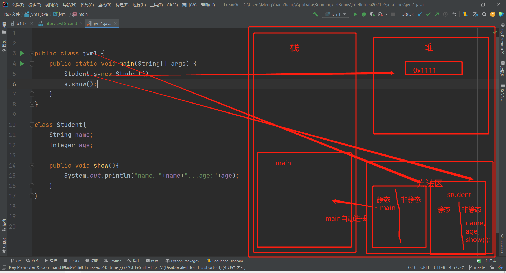

#自用面试文档

##一、HashMap的特性
**结构**
>HashMap的底层实现是数组+链表+红黑树（jdk8之后）

**数据插入**
>当往map加入元素时 
>* 1、调用待插入元素的hashCode()方法，根据hashCode的值来确定存入hashMap的大数组的那一索引。
>* 2、如获取的索引空间没有元素，便直接插入到该元素位置。
>* 3、如获取的索引空间有元素，则调用插入元素的equals()方法与原元素比较。如返回true则后来元素覆盖前一元素 反之则挂在原有元素的下面形成链表结构（jdk8之后到达链表大小超过或等于8时会转化成红黑树结构）

**扩展 hashCode()与equal()的关系**
> hashCode()相等，equal()有可能相等 
> hashCode()不相等，equal()一定不相等 
> equal()相等，hashCode()一定相等 
> equal()不相等，hashCode()有可能相等

##二、java虚拟机中的模型

**java虚拟机有哪几块内存空间**
>**五种**
>* 1、栈内存*
>* 2、方法区*
>* 3、堆内存*
>* 4、寄存器
>* 5、本地方法区

**执行流程**

